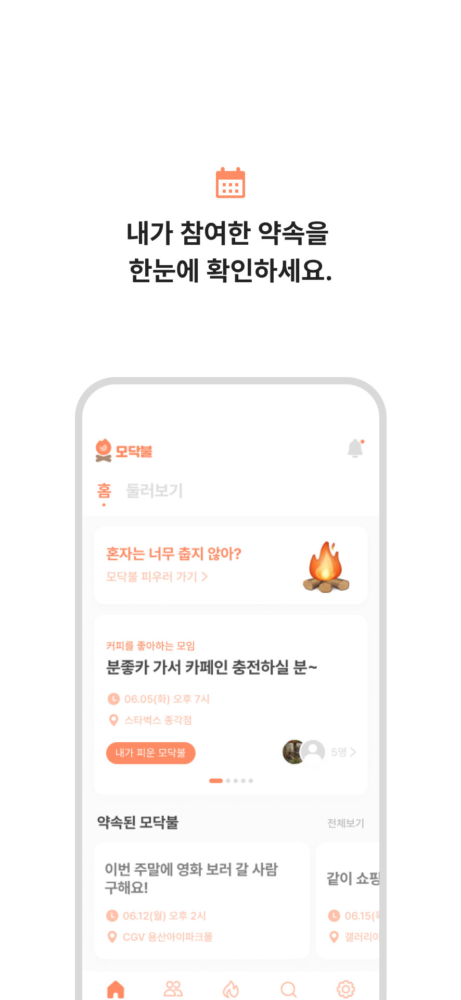
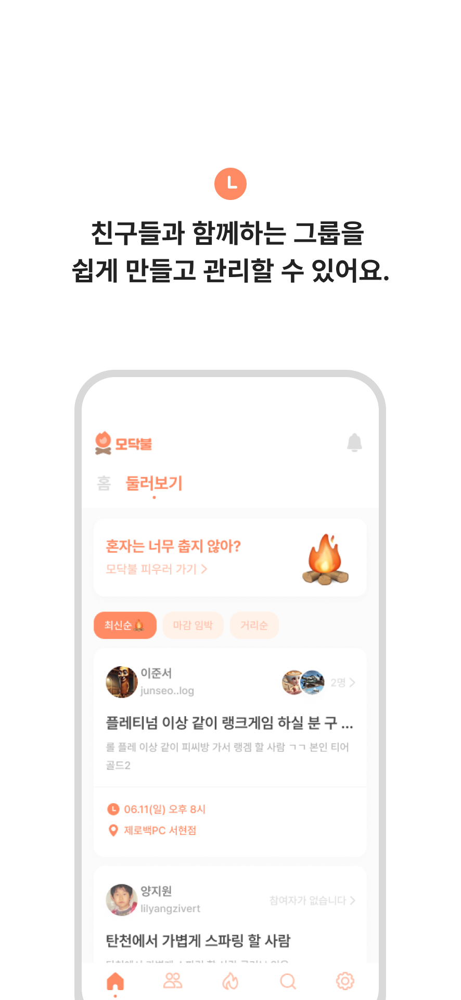
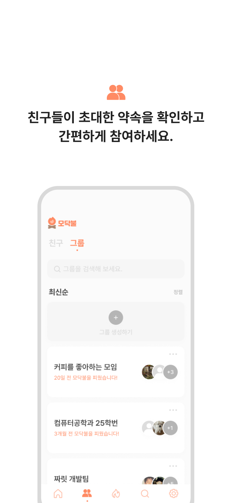
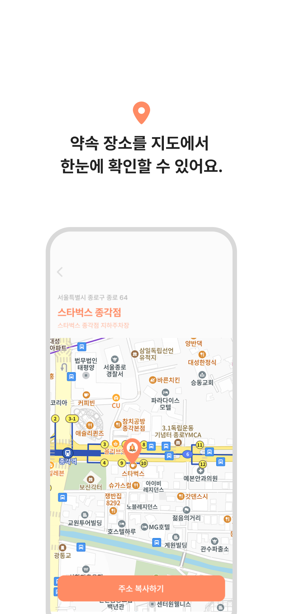
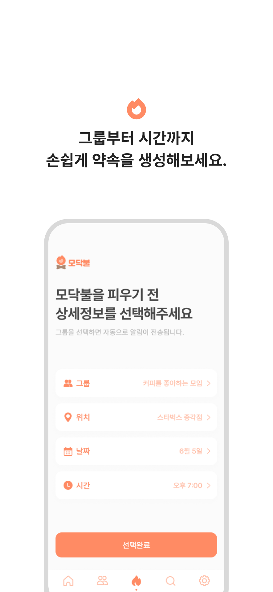
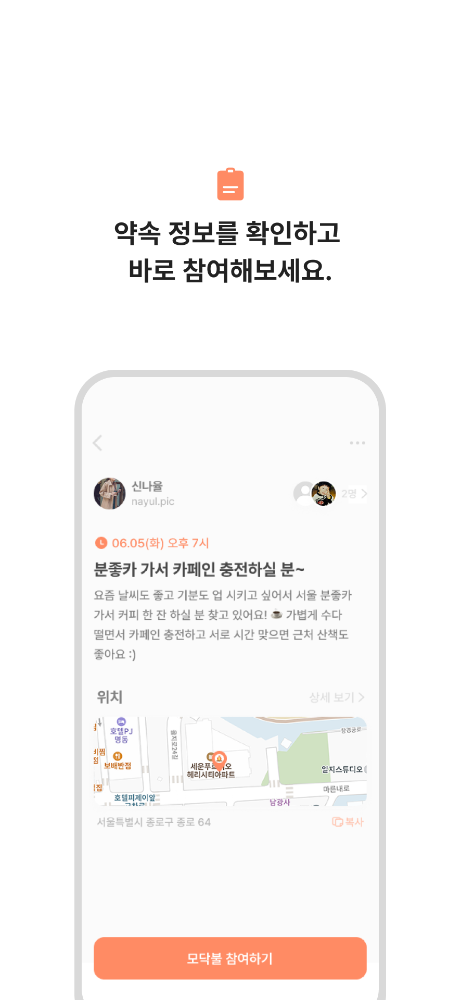
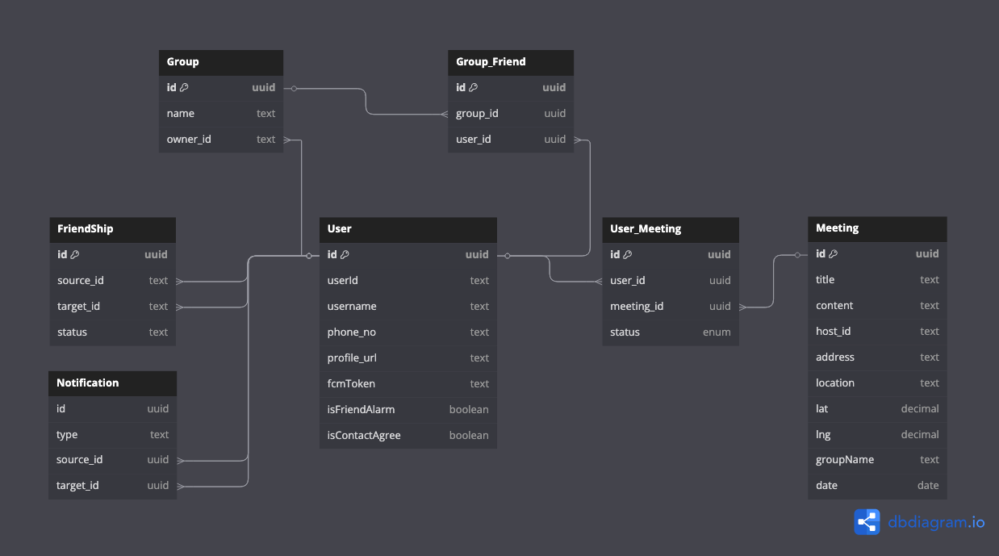

# 🔥 모닥불 - 번개약속 관리 어플리케이션

친구들과 쉽고 빠르게 약속을 잡는 가장 스마트한 방법!  
모닥불과 함께 번개약속을 더 간편하게, 더 즐겁게 관리하세요.

<table>
  <tr>
    <td></td>
    <td></td>
    <td></td>
  </tr>
</table>

---

## 👥 Contributors
<table align="center">
  <tr>
    <td align="center">Backend</td>
    <td align="center">Backend</td>
  </tr>
  <tr>
    <td>
      
    </td>
    <td>
      
    </td>
  <tr>
  <tr>
    <td align="center">
      <a href="https://github.com/baecheolhyoen">배철현</a>
    </td>
    <td align="center">
      <a href="https://github.com/Taylor2921">김태현</a>
    </td>
  </tr>
</table>

---

## 🚀 서비스 소개

### 📌 개요

**모닥불**은 번개약속 관리를 위해 만들어진 어플리케이션으로,  
SNS처럼 친구를 추가하고, 모임과 약속을 쉽고 빠르게 생성 및 관리할 수 있는 플랫폼입니다.

> 친구들과 약속 잡기가 번거로웠다면,  
> 모닥불에서 모든 과정을 간편하게 해결해보세요!

---

### 📑 문제 정의 및 해결책

- **문제점**
    - 약속을 잡기 위해 여러 앱과 연락처를 왔다 갔다 해야 하는 불편함
    - 친구와 모임 관리가 어렵고 흩어져 있음
    - 약속 시간 및 약속 장소를 관리하기 힘듬

- **해결책**
    - 친구 추가 기능으로 쉽게 관계 형성
    - 모임 생성 및 관리 기능으로 체계적 모임 운영
    - 약속 생성 및 실시간 알림으로 일정 공유 및 관리 강화

---

## 🧑‍💻 주요 기능

| 기능     | 설명                                  |
|--------|-------------------------------------|
| 친구 추가  | 사용자간 친구 요청 및 수락을 통해 네트워크를 형성합니다     |
| 모임 생성  | 관심사나 목적에 맞는 모임을 생성하고 멤버를 초대할 수 있습니다 |
| 약속 생성  | 모임 내에서 번개약속을 생성하고 참석 여부를 관리할 수 있습니다 |
| 실시간 알림 | 약속 초대, 친구 요청 등 주요 이벤트를 실시간으로 알림받습니다 |
| 장소 기능  | 지도에서 약속 장소의 정확한 위치를 확인합니다           |
<table>
  <tr>
    <td></td>
    <td></td>
    <td></td>
  </tr>
  <tr>
    <td></td>
    <td></td>
    <td></td>
  </tr>
</table>

---

## ⚙️ Backend Tech Stack

---

## 🧱 ERD 설계도

